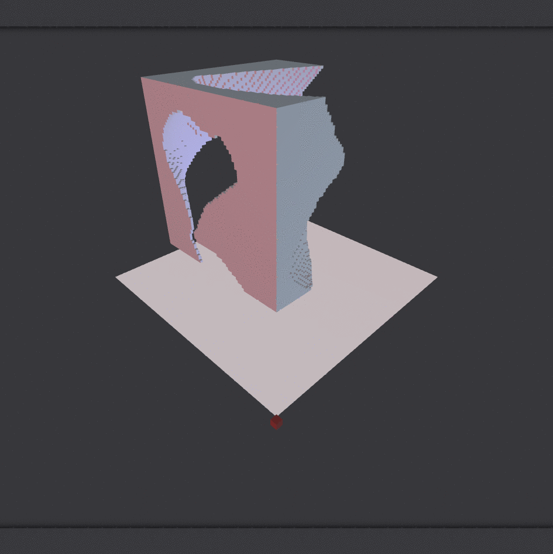
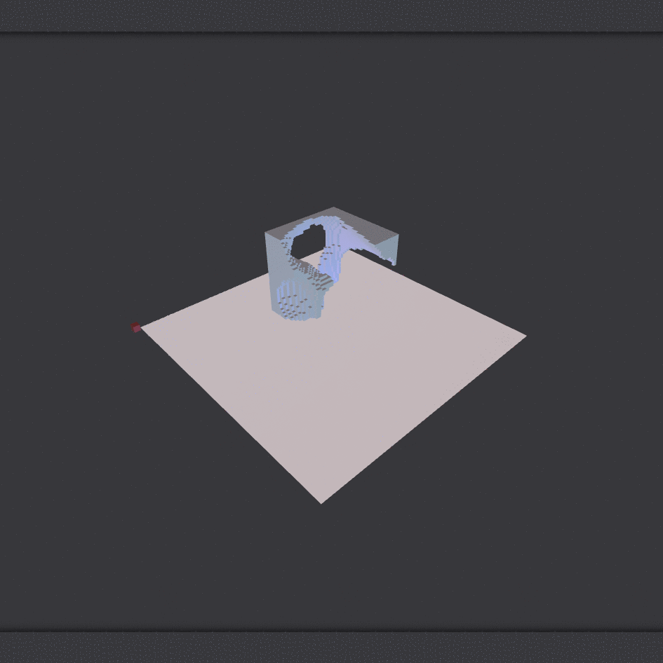

# voxCPPN
Generative CPPN-like neural network with latent vectors for voxel shape encoding/generation.
The main network is a small CPPN-like feedforward neural network that encodes binary voxel shapes. The input to the net 
is (x, y, z, radius, latent) and the output is the probability of a voxel at that position. Each shape the network encodes is assigned a latent vector, creating a traversable search space of data in between the encoded voxel shapes.
The network in this project has a low number of parameters and can be trained on a CPU in <10 minutes. Train on a low 
resolution such as the default 32^3 and visualize at a higher resolution 64-256^3.
-Implemented with Tensorflow.
-Be careful with visualizations at 256^3 resolution, memory can run out quickly.


Smooth movement through the latent space of three encoded voxel shapes.

Arbitrary resolution effect (feeding in a larger SIZE parameter)


### Prerequisites
```
pip install -r requirements.txt
```

## Basic Usage
With each of the following commands the generated voxels are visualized in the browser.

Generate voxel shapes with a CPPN to encode with another network.
On the first run this will generate coordinate datasets and may take awhile.
```
python newshape.py 
```
Train the CPPN-like neural network to encode the generated shapes, takes <10 minutes on CPU.
```
python net.py --op train
```
Run the trained network on a specific latent vector. Default is 0 for the first latent vector.
```
python run.py
```
Run the trained network and traverse the latent space.
```
python net.py --op latent
```
## Full Usage
newshape.py
```
usage: newshape.py [-h] [--size SIZE] [--amount AMOUNT] [--seed SEED]

optional arguments:
  -h, --help       show this help message and exit
  --size SIZE      Voxel dimensions cubed
  --amount AMOUNT  The number of voxel shapes to generate
  --seed SEED      tensorflow weight init seed
```
net.py
```
usage: net.py [-h] [--op OP] [--size SIZE] [--seed SEED]

optional arguments:
  -h, --help   show this help message and exit
  --op OP      operation to complete: train | latent
  --size SIZE  Voxel dimensions cubed, can be different size for train vs
               latent op
  --seed SEED  tensorflow weight init seed
```
run.py
```
usage: run.py [-h] [--shape SHAPE] [--size SIZE] [--seed SEED]

optional arguments:
  -h, --help     show this help message and exit
  --shape SHAPE  number of the shape to output
  --size SIZE    Voxel dimensions cubed, can be different size for train vs
                 latent op
  --seed SEED    latent vector seed
```

